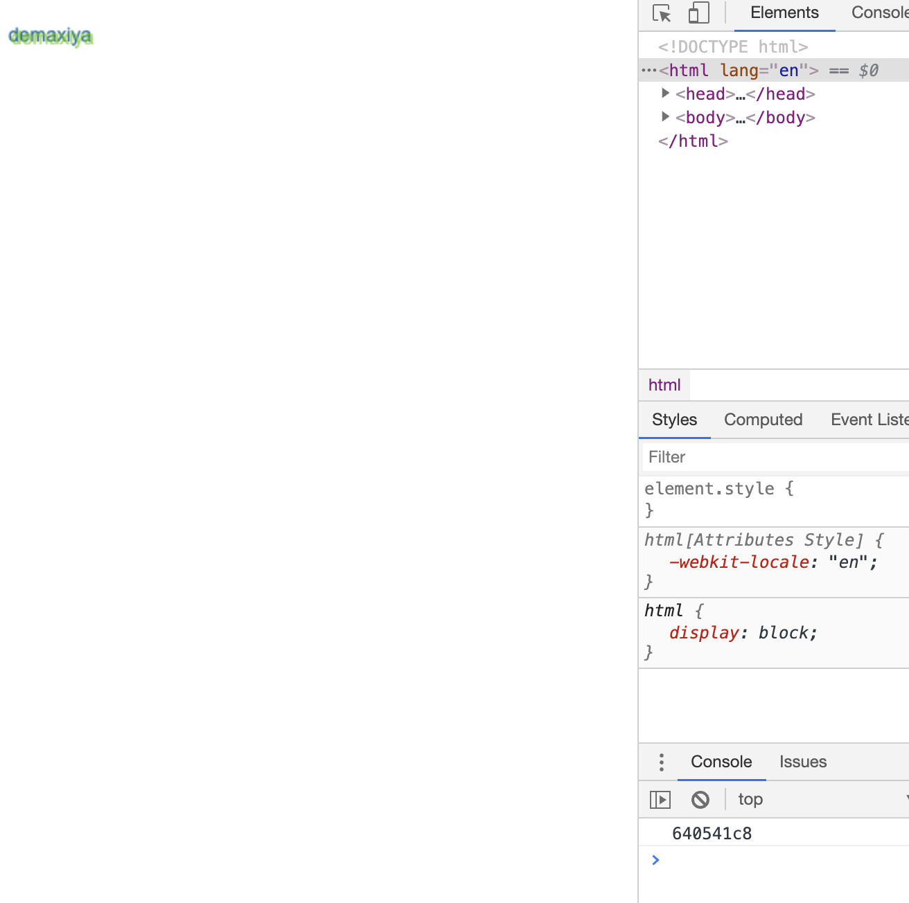

# <center>浏览器指纹识别</center>
## 简介  
通过浏览器的各种信息，如系统字体、屏幕分辨率、浏览器插件，无需 cookie 等技术，就能近乎绝对定位一个用户，就算使用浏览器的隐私窗口模式，也无法匿名。这是一个被动的识别方式。也就是说，理论上你访问了某一个网站，那么这个网站就能识别到你，虽然不知道你是谁，但你有一个唯一的指纹，将来无论是广告投放、精准推送，还是其他一些关于隐私的事情，都非常方便  
## 三个阶段  
理海大学曾发表论文（[ (Cross-)Browser Fingerprinting via OS and Hardware Level Features ](http://yinzhicao.org/TrackingFree/crossbrowsertracking_NDSS17.pdf )），将浏览器指纹识别分为三个阶段  

1.cookie在客户端设置标志的追踪技术  
2.通过设备信息（操作系统、分辨率、像素比），综合起来生成ID  
3.人的习惯、人的行为等等来对人进行归并     
 
目前大多数应用使用的是通过设备信息来实现指纹，如12306使用Canvas技术

## Canvas  
相同的HTML5 Canvas元素绘制操作，在不同操作系统、不同浏览器上，产生的图片内容不完全相同。在图片格式上，不同浏览器使用了不同的图形处理引擎、不同的图片导出选项、不同的默认压缩级别等。在像素级别来看，操作系统各自使用了不同的设置和算法来进行抗锯齿和子像素渲染操作。即使相同的绘图操作，产生的图片数据的CRC(循环冗余效验)检验也不相同。
基于Canvas标签绘制特定内容的图片，使用canvas.toDataURL()方法获得图片内容的base64编码（对于PNG格式的图片，以块(chunk)划分，最后一块是32位CRC校验）作为唯一性标识。   
  
首先我们需要一个ASCII 字符的字符串转换为十六进制值的方案   
````
function bin2hex(s) {
    var i, l, o = '',
        n;  
        
    s += '';

    for (i = 0, l = s.length; i < l; i++) {
        n = s.charCodeAt(i)
            .toString(16);
        o += n.length < 2 ? '0' + n : n;
    }

    return o;
}
````  
然后页面上写一个canvas，注意不能没有大小的的canvas，宽度和高度不能为0，可以对canvas进行一些绘制  
````javascript
function fp() {
    let canvas = document.getElementById("myCanvas");
    var ctx = canvas.getContext('2d');
    var txt = 'demaxiya';
    ctx.textBaseline = "top";
    ctx.font = "14px 'Arial'";
    ctx.fillStyle = "#f60";
    ctx.fillRect(125,1,62,20);
    ctx.fillStyle = "#069";
    ctx.fillText(txt, 2, 15);
    ctx.fillStyle = "rgba(102, 204, 0, 0.7)";
    ctx.fillText(txt, 4, 17);
    var b64 = canvas.toDataURL().replace("data:image/png;base64,","");
    var bin = atob(b64); // 解码使用 base-64 编码的字符串
    var crc = bin2hex(bin.slice(-16,-12)); //ASCII字符的字符串转换为六进制值的字符串
    return crc;
}
````  
  
## Audiocontext  
Audio API则让开发者有能力在代码中直接操作原始的音频流数据，对其进行任意生成、加工、再造，诸如提高音色，改变音调，音频分割等多种操作
主机或浏览器硬件或软件的细微差别，导致音频信号的处理上的差异，相同器上的同款浏览器产生相同的音频输出，不同机器或不同浏览器产生的音频输出会存在差异。
从上可以看出AudioContext和Canvas指纹原理很类似，都是利用硬件或软件的差异，前者生成音频，后者生成图片，然后计算得到不同哈希值来作为标识  
生成音频信息流(三角波)，对其进行FFT变换，计算SHA值作为指纹，音频输出到音频设备之前进行清除，用户毫无察觉。  

[指纹识别源码](https://github.com/guanxiaolong/codesource/blob/master/fp/js/audio.js )

